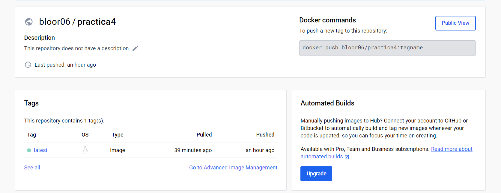
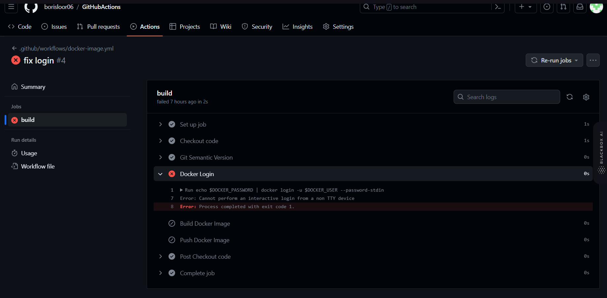

# GitHub Action Push of Images to DockerHub

## Resumen

Esta practica demuestra el proceso de subir una imagen de docker automaticamente a dockerhub y versionado del mismo, a continuacion se demuestra la implementación exitosa de los pasos realizados los pasos.

## Subida manual de imagenes a DockerHub

### 1. Build and push image to DockerHub

---

### 2. Prueba de ejecución de la imagen

Verificar que la imagen se ejecuta correctamente.

### 3. DockerHub Image

Verificar que la imagen se encuentra en DockerHub.

## Problemas encontrados

### 4. Login Error

Durante el proceso de cración de la github action se presento un error de login a Dockerhub, el cual se soluciono con la creación de un token de acceso en dockerhub y la creación de un secreto en el repositorio de github, porque solo estaban creadas a nivel de enviroment.

## Successful Actions

### 5. Push Success

Confirmation that the image has been successfully pushed to DockerHub.

---

### 6. Versionado exitoso

Demostración de la versión exitosa de la imagen de DockerHub.

## Pruebas

### 7. Historial de intentos fallidos

---

### 8. Prueba de ejecución de action feat:

---

## Conclusion

Se logro realizar la subida de la imagen de docker a dockerhub de forma automatica, con la creación de un tag de versionado, y la creación de un secreto en el repositorio de github para el acceso a dockerhub.

